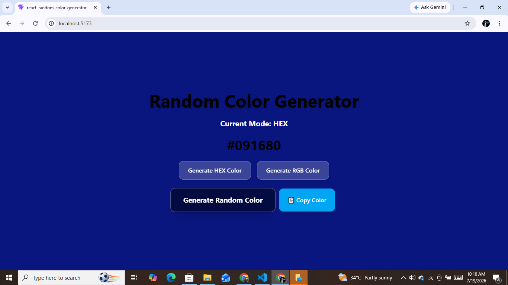
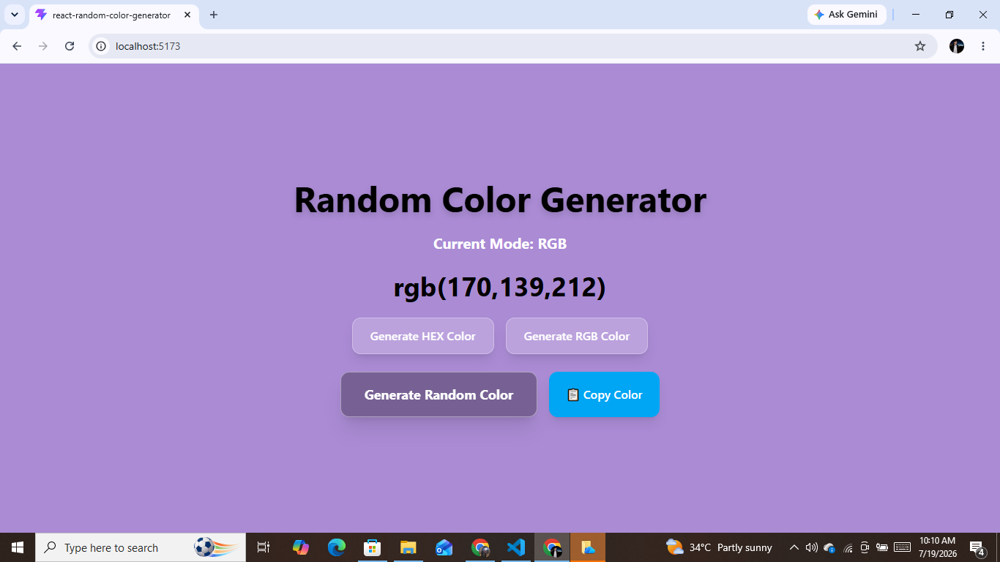

# 🎨 Random Color Generator

A modern React application that generates random **HEX** and **RGB** colors with a dynamic background. Users can switch between color modes, generate random colors, and copy the generated color value to the clipboard.

---

## 🚀 Live Demo

**Live Website:** https://react-random-color-generator-wheat.vercel.app


## 📸 Preview

### HEX Color Mode




### RGB Color Mode


---

## ✨ Features

- 🎨 Generate random **HEX** colors
- 🌈 Generate random **RGB** colors
- 🔄 Switch between HEX and RGB modes
- 🖥️ Dynamic background color updates
- 📋 Copy generated color to clipboard
- ✅ Copy confirmation message
- ⚡ Smooth UI transitions
- 📱 Responsive design
- 💎 Modern glassmorphism-inspired UI

---

## 🛠️ Built With

- React
- JavaScript (ES6+)
- Vite
- Tailwind CSS

---

## 📚 Concepts Practiced

### React

- Functional Components
- useState Hook
- Event Handling
- Conditional Rendering
- Dynamic Inline Styling
- State Management

### JavaScript

- Arrays
- for Loop
- if...else
- Ternary Operator
- Math.random()
- Math.floor()
- Template Literals
- Clipboard API
- setTimeout()

---

## 📂 Project Structure

```
react-random-color-generator/
│
├── assets/
│     ├── hex.png
│     └── rgb.png
│
├── src/
├── public/
├── README.md
├── package.json

---

## ⚙️ Installation

Clone the repository

```bash
git clone <your-repository-url>
```

Go to the project folder

```bash
cd react-random-color-generator
```

Install dependencies

```bash
npm install
```

Start the development server

```bash
npm run dev
```

---

## 💡 How It Works

### HEX Mode

- Generates six random hexadecimal characters.
- Creates a valid HEX color.
- Updates the background dynamically.

Example:

```
#A3F91C
```

---

### RGB Mode

- Generates random values for:
  - Red (0–255)
  - Green (0–255)
  - Blue (0–255)
- Combines them into a valid RGB color.

Example:

```
rgb(123, 45, 210)
```

---

### Copy Color

Clicking the **Copy Color** button copies the generated color value to the clipboard and displays a temporary confirmation message.

---

## 🎯 Learning Outcomes

Through this project, I practiced:

- Building reusable React components
- Managing UI with React state
- Working with random number generation
- Updating styles dynamically
- Creating interactive user interfaces
- Implementing Clipboard functionality
- Improving user experience with visual feedback

---

## 📌 Future Improvements

- Automatic text color adjustment for HEX colors
- Copy success toast notification
- Color history
- Favorite colors
- Dark/Light theme toggle
- Download color palette

---

## 👨‍💻 Author

**Shahzad Ahmad Gull**

GitHub: https://github.com/shahzadgull46

---

⭐ If you found this project helpful, consider giving it a star!